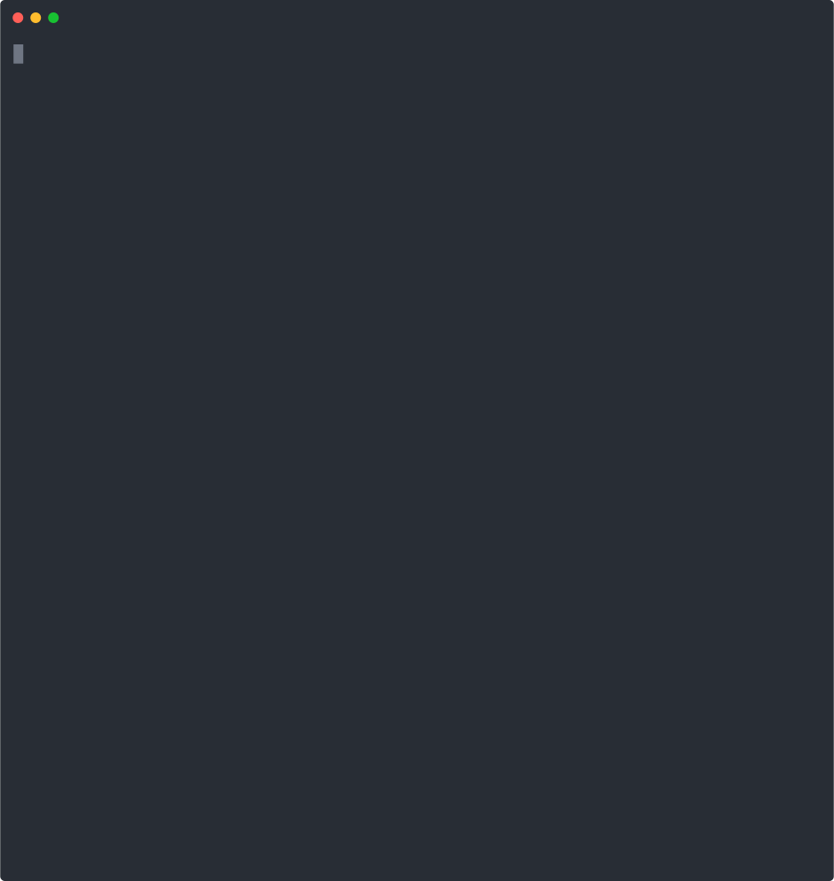

# tetromino
Tetromino Elektronika -- an ASCII Falling Tetromino Game
by Patrick Devine, 2018

## TL;DR
A falling tetromino block game based upon NES Tetris in the style of the original 1984 Tetris by Alexey Pajitnov that will run in Kubernetes or Docker.

If you have a kubernetes cluster, you can run it with the command:

```
  $ kubectl run -it --rm --image=ghcr.io/pdevine/tetromino tetromino
```


... and if you don't have kubernetes, but have docker, try it with:

```
  $ docker run -it --rm ghcr.io/pdevine/tetromino
```

It should look something like:




## Features

 * An homage to the original [Tetris](https://en.wikipedia.org/wiki/Tetris) written for the [Electronika 60](https://en.wikipedia.org/wiki/Electronika_60)

 * Similar speeds and scoring as [NES Tetris](https://en.wikipedia.org/wiki/Tetris_(NES_video_game))

 * Runs on kubernetes clusters, docker, or just straight from the terminal

 * Random seed control allows you to use pre-defined sets of tetrominos

 * Written with Golang and [Go-AsciiSprite](https://github.com/pdevine/go-asciisprite)

 * Freely available with source

Check out the [about page](./ABOUT.md) for more details.
